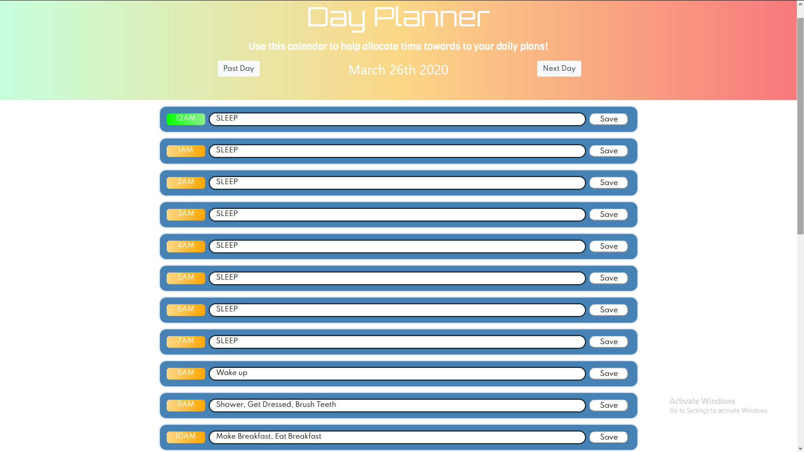

# DayPlannerHomework

# OVERVIEW
This application acts as a personal callender for scheduling all your daily activities such as walking the dog, exercise, getting a haircut, etc.
Here is a link to the application: https://alex-waite.github.io/DayPlannerHomework/
 
below is a screenshot of it working
 

# ISSUES I AM AWARE OF
These are features I am aware dont work as intended and i am working on fixing them:
 
_Each new day does not clear the entrys from the last_
 
_Each new day still marks the current hour as present even thought the same hour on a different day is not present (same for past and future indicators)_
 
contact: alexanderconorwaite@gmail.com
# Made with love by Alex Waite, Last edit 25/03/2020
